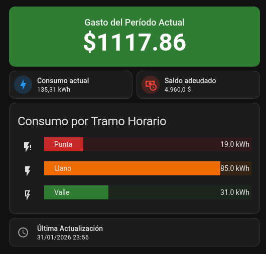

# Ute2MQTT

Obtiene datos de consumo eléctrico desde la API del proveedor de energía y los publica a Home Assistant via MQTT.

---

## ⚠️ Disclaimers

> [!IMPORTANT]
> **Avisos Legales y de Seguridad**
>
> - **Proyecto Personal:** Desarrollado para fines educativos y uso personal. No tiene afiliación comercial ni respaldo oficial de ninguna entidad.
> - **Responsabilidad:** El uso es bajo tu propio riesgo. El autor no garantiza el funcionamiento ni se hace responsable por el uso del software. Te recomiendo revisar el código antes de ejecutarlo.
> - **Seguridad:** Se manejan credenciales sensibles (cifradas con Fernet/AES-128). **NUNCA** compartas logs, capturas o archivos con tus datos personales.
> - **Marcas:** Todas las marcas mencionadas (UTE, Home Assistant, MQTT, Mosquitto, etc.) son propiedad de sus respectivos titulares. Este software no está afiliado, respaldado ni patrocinado por ninguna de estas entidades. El uso de nombres de marca es solo con fines descriptivos e identificativos.

---

## ✨ Funcionalidades

- ✅ **Autenticación OAuth2 Completa**: Gestión automática de tokens de acceso
- ✅ **Almacenamiento Seguro**: Credenciales y tokens cifrados con Fernet
- ✅ **Auto-descubrimiento**: Integración automática con Home Assistant via MQTT Discovery
- ✅ **Multi-tarifa**: Soporte para TRT (Triple), TRD (Doble), TRS/TGS (Simple)
- ✅ **Reautenticación Automática**: Se reautentica automáticamente si los tokens expiran
- ✅ **Ejecución Programada**: Scheduler configurable con ventanas horarias AM/PM
- ✅ **Containerizado**: Completamente dockerizado para fácil despliegue
- ✅ **Sensores en Tiempo Real**: Consumo, gasto, deuda y desglose por franja horaria

---

## 📋 Requisitos Previos

### 1. MQTT Broker (Obligatorio)

Necesitás un broker MQTT funcionando. Podés usar cualquiera de estas opciones:

#### Opción A: Home Assistant OS - Addon Mosquitto
1. Ir a **Settings** → **Add-ons** → **Add-on Store**
2. Buscar e instalar **Mosquitto broker**
3. Iniciar el addon y habilitar "Start on boot"

#### Opción B: Docker (Mosquitto standalone)
```bash
docker run -d \
  --name mosquitto \
  -p 1883:1883 \
  -p 9001:9001 \
  eclipse-mosquitto
```

#### Opción C: Instalación nativa
```bash
# Ubuntu/Debian
sudo apt-get install mosquitto mosquitto-clients

# Fedora/RHEL
sudo dnf install mosquitto
```

### 2. Docker y Docker Compose

```bash
# Verificar instalación
docker --version
docker compose version
```

### 3. Cuenta de Proveedor de Energía

- Cuenta activa con acceso al portal web
- Cédula de identidad y contraseña

---

## 🚀 Instalación Paso a Paso

### Paso 1: Clonar el repositorio

```bash
git clone https://github.com/rodrigocabraln/Ute2MQTT.git
cd Ute2MQTT
```

### Paso 2: Crear carpeta para credenciales y asignar permisos

Es fundamental crear la carpeta manualmente y asignar los permisos correctos para que el proceso dentro de Docker (que corre con el UID 1000) pueda escribir los archivos de sesión cifrados. 

Si omitís este paso o dejás que Docker cree la carpeta automáticamente, se creará como `root` y la aplicación fallará al intentar guardar tus datos.

```bash
mkdir -p credentials
# Asignar permisos al usuario del contenedor (UID 1000)
sudo chown -R 1000:1000 credentials
```

> [!IMPORTANT]
> **Persistencia:** Esta carpeta es vital. Aquí se guardan tus tokens y configuración cifrada. Si la borrás, tendrás que repetir el proceso de setup.

### Paso 3: Construir la imagen Docker

```bash
docker compose build
```

### Paso 4: Crear archivo de entorno

```bash
cp .env.example .env
```

### Paso 5: Ejecutar setup interactivo

```bash
docker compose run --rm ute2mqtt python setup.py
```

El setup te pedirá:
- **Cédula de identidad** (sin puntos ni guiones)
- **Contraseña** de tu cuenta

Luego mostrará tus cuentas disponibles:

```
📍 Cuentas disponibles:
------------------------------------------------------------
   [1] Account ID: <ACCOUNT_ID>
       Dirección: <ADDRESS>
       Service ID: <SERVICE_ID>
       Service Point ID: <SERVICE_POINT_ID>
       Tariff: <TARIFF>
------------------------------------------------------------

🔐 Guardando tokens...
✅ Tokens guardados (cifrados)

Copiar esta línea a tu .env:
UTE_ACCOUNT_ID=<ACCOUNT_ID>
UTE_SERVICE_ID=<SERVICE_ID>
UTE_SERVICE_POINT_ID=<SERVICE_POINT_ID>
UTE_TARIFF=<TARIFF>
# Si tenés tarifa TRT/TRD:
UTE_SCHEDULE_CODE=<SCHEDULE_CODE>
```

> [!IMPORTANT]
> **Cambios en Contrato o Tarifa**
>
> Si en el futuro realizás cambios en tu contrato (ej. cambio de plan, cambio de potencia, mudanza) debés **volver a ejecutar este paso (setup.py)**. Esto es necesario para actualizar los identificadores de servicio y la tarifa configurada en el sistema.

### Paso 6: Completar configuración .env

Editá `.env` con el Account ID obtenido y tu configuración MQTT:

```env
# ID de cuenta obtenido del setup
UTE_ACCOUNT_ID=<ACCOUNT_ID>
UTE_SERVICE_ID=<SERVICE_ID>
UTE_SERVICE_POINT_ID=<SERVICE_POINT_ID>
UTE_TARIFF=<TARIFF>
UTE_SCHEDULE_CODE=<SCHEDULE_CODE>

ENCRYPTION_KEY=abc123def456...

# Configuración MQTT
MQTT_BROKER=192.168.1.100    # IP de tu broker MQTT
MQTT_PORT=1883                # Puerto estándar
MQTT_USERNAME=                # Opcional
MQTT_PASSWORD=                # Opcional
MQTT_TOPIC_PREFIX=UTE      # Prefijo de topics

# Horario de ejecución: AM (6:00-12:00) o PM (12:00-18:00)
SCHEDULE_TIME=AM
```

### Paso 7: Verificar conectividad MQTT

Antes de iniciar el contenedor, verificá que podés conectarte al broker:

```bash
# Instalar cliente MQTT si no lo tenés
sudo apt-get install mosquitto-clients

# Test de publicación
mosquitto_pub -h 192.168.1.100 -t test -m "hello"

# Test de suscripción (en otra terminal)
mosquitto_sub -h 192.168.1.100 -t test
```

### Paso 8: Iniciar el contenedor

```bash
docker compose up -d
```

### Paso 9: Verificar logs

```bash
docker compose logs -f
```

Deberías ver algo como:

```
INFO - Iniciando Ute2MQTT...
INFO - MQTT conectado exitosamente
INFO - Publicando discovery messages...
INFO - Datos publicados exitosamente
INFO - Próxima ejecución programada: ...
```

---

## 🏠 Integración con Home Assistant

### 1. Configurar Integración MQTT

Si aún no tenés configurado MQTT en Home Assistant:

1. Ve a **Settings** → **Devices & Services**
2. Hacé clic en **Add Integration**
3. Buscá **MQTT**
4. Ingresá los datos de tu broker (Host, Puerto, Usuario/Password)
5. La opción de Discovery viene activada por defecto


### 2. Verificar sensores

Después de la primera ejecución del cliente, los sensores aparecerán automáticamente en:

**Settings** → **Devices & Services** → **MQTT** → **Devices**

### 2. Verificar sensores

Después de la primera ejecución del cliente, los sensores aparecerán automáticamente en:

**Settings** → **Devices & Services** → **MQTT** → **Devices**

Buscar el device "UTE {service_id}".

### 3. Instalar Custom Cards (Opcional)

Para usar el ejemplo Lovelace que se muestra más abajo, necesitás instalar estas custom cards via HACS:

| Card | Repositorio |
|------|------------|
| **Button Card** | [custom-cards/button-card](https://github.com/custom-cards/button-card) |
| **Mushroom Cards** | [piitaya/lovelace-mushroom](https://github.com/piitaya/lovelace-mushroom) |
| **Bar Card** | [custom-cards/bar-card](https://github.com/custom-cards/bar-card) |

**Instalación via HACS:**
1. Abrir HACS → Frontend
2. Buscar cada card por nombre
3. Instalar y reiniciar Home Assistant

---

## 📊 Ejemplo Lovelace

> [!NOTE]
> Este ejemplo está diseñado para **servicios con tarifa TRT (Triple)** que incluyen desglose por franja horaria (Punta, Llano, Valle).
> 
> Si tenés tarifa TRD o TRS/TGS, algunos sensores no estarán disponibles y deberás ajustar el código eliminando las secciones correspondientes.

A continuación un ejemplo de dashboard completo:



```yaml
type: vertical-stack
cards:
  - type: custom:button-card
    entity: sensor.ute_{service_id}_gasto_actual
    name: Gasto del Período Actual
    show_state: true
    show_icon: true
    icon: mdi:currency-usd
    styles:
      card:
        - height: 120px
        - background: |
            [[[ 
              const gasto = parseFloat(entity.state);
              if (gasto < 2000) return '#2e7d32';
              if (gasto < 3000) return '#ef6c00';
              if (gasto < 4000) return '#c52828';
              return '#F44336';
            ]]]
        - border: none
        - box-shadow: 0 2px 4px rgba(0,0,0,0.1)
        - border-radius: var(--ha-card-border-radius, 12px)
      icon:
        - color: white
        - width: 50px
        - margin-right: 20px
      name:
        - font-size: 18px
        - color: rgba(255,255,255,0.9)
        - font-weight: 500
      state:
        - font-size: 48px
        - font-weight: 600
        - color: white
      grid:
        - grid-template-areas: "\"i n\" \"i s\""
        - grid-template-columns: auto 1fr
        - grid-template-rows: auto auto
    state_display: |
      [[[
        return '$' + parseFloat(entity.state).toFixed(2);
      ]]]
  - type: horizontal-stack
    cards:
      - type: custom:mushroom-entity-card
        entity: sensor.ute_{service_id}_consumo_actual
        name: Consumo actual
        icon: mdi:lightning-bolt
        icon_color: blue
        primary_info: name
        secondary_info: state
      - type: custom:mushroom-entity-card
        entity: sensor.ute_{service_id}_deuda_total
        name: Saldo adeudado
        icon: mdi:cash-clock
        icon_color: red
        primary_info: name
        secondary_info: state
  - type: custom:bar-card
    entities:
      - entity: sensor.ute_{service_id}_consumo_punta
        name: Punta
        color: "#C62828"
        icon: mdi:flash-alert
      - entity: sensor.ute_{service_id}_consumo_llano
        name: Llano
        color: "#EF6C00"
        icon: mdi:flash
      - entity: sensor.ute_{service_id}_consumo_valle
        name: Valle
        color: "#2E7D32"
        icon: mdi:flash-outline
    title: Consumo por Tramo Horario
    unit_of_measurement: kWh
    height: 28px
    padding: 2px
    columns: 1
    positions:
      icon: outside
      indicator: inside
      name: inside
      value: inside
    card_mod:
      style: |
        ha-card {
          padding: 8px;
          /* Forzamos texto blanco y negrita usando variables nativas */
          --bar-card-title-color: #FFFFFF;
          --bar-card-value-color: #FFFFFF;
          font-weight: 700;
          text-shadow: 1px 1px 2px rgba(0,0,0,0.5); /* Sombra suave compatible */
        }
        bar-card-row {
          margin: 2px 0;
        }
  - type: custom:mushroom-template-card
    primary: Última Actualización
    secondary: >
      {{ as_timestamp(states('sensor.ute_{service_id}_ultima_actualizacion')) |
      timestamp_custom('%d/%m/%Y %H:%M', true) }}
    icon: mdi:clock-outline
    icon_color: grey
    layout: horizontal
```

**Recordá reemplazar `{service_id}` con tu ID de servicio real** en todos los nombres de sensores.

---

## 📡 Sensores Disponibles

Una vez ejecutado, aparecerán estos sensores via MQTT Discovery:

| Sensor | Descripción | Disponible en |
|--------|-------------|---------------|
| `sensor.ute_{service_id}_consumo_actual` | Consumo total en kWh | Todas las tarifas |
| `sensor.ute_{service_id}_gasto_actual` | Gasto estimado en $ | Todas las tarifas |
| `sensor.ute_{service_id}_deuda_total` | Deuda pendiente en $ | Todas las tarifas |
| `sensor.ute_{service_id}_consumo_punta` | Consumo horario punta | TRT, TRD |
| `sensor.ute_{service_id}_consumo_llano` | Consumo horario llano | TRT |
| `sensor.ute_{service_id}_consumo_valle` | Consumo horario valle | TRT |
| `sensor.ute_{service_id}_ultima_actualizacion` | Timestamp última actualización | Todas las tarifas |

---

## 🔌 Tarifas Soportadas

El cliente detecta automáticamente tu tarifa y ajusta los sensores disponibles:

- **TRT (Tarifa Residencial Triple)**: Desglose completo (Punta, Llano, Valle)
- **TRD (Tarifa Residencial Doble)**: Desglose parcial (Punta, Fuera de Punta). *Nota: UTE no expone correctamente la información para este plan, por lo que se suman los valores disponibles.*
- **TRS (Tarifa Residencial Simple) / TGS (Tarifa General Simple)**: Solo consumo total

---

## ⚙️ Variables de Entorno

| Variable | Descripción | Requerido | Default |
|----------|-------------|-----------|---------|
| `UTE_ACCOUNT_ID` | ID de cuenta del proveedor | ✅ | - |
| `UTE_SERVICE_ID` | ID del servicio (Service Agreement ID) | ✅ | - |
| `UTE_SERVICE_POINT_ID` | ID del punto de servicio (Service Point ID) | ✅ | - |
| `UTE_TARIFF` | Tarifa del servicio (TRT, TRD, etc.) | ✅ | - |
| `UTE_SCHEDULE_CODE` | Código de horario punta (ej. TRIPLERES19). Solo para TRT/TRD | ✅ (si aplica) | - |
| `ENCRYPTION_KEY` | Clave de cifrado (64 caracteres hex) | ✅ | - |
| `CREDENTIALS_PATH` | Ruta para almacenar credenciales cifradas | ❌ | `./credentials` |
| `MQTT_BROKER` | Hostname/IP del broker MQTT | ✅ | - |
| `MQTT_PORT` | Puerto del broker MQTT | ❌ | `1883` |
| `MQTT_USERNAME` | Usuario MQTT | ❌ | - |
| `MQTT_PASSWORD` | Contraseña MQTT | ❌ | - |
| `MQTT_TOPIC_PREFIX` | Prefijo para topics MQTT | ❌ | `UTE` |
| `MQTT_DISCOVERY_PREFIX` | Prefijo para Auto-descubrimiento | ❌ | `discovery` |
| `MQTT_CLIENT_ID` | ID del cliente MQTT | ❌ | Dinámico |
| `SCHEDULE_TIME` | Horario de ejecución: `AM` o `PM` | ❌ | `AM` |

**Notas:**
- `AM`: Ejecución aleatoria entre 6:00 y 12:00
- `PM`: Ejecución aleatoria entre 12:00 y 18:00

---

## 🔒 Seguridad

- **Cifrado Fernet**: Tokens y credenciales almacenados con AES-128 + PBKDF2
- **Credenciales persistentes**: Se guardan cifradas para reautenticación automática
- **Refresh automático**: Los tokens se renuevan automáticamente antes de expirar
- **Reautenticación resiliente**: Si el refresh falla, intenta reautenticar una vez antes de requerir intervención manual

---

## 📝 Comandos Útiles

```bash
# Ver logs en tiempo real
docker compose logs -f

# Reiniciar el servicio
docker compose restart

# Detener el servicio
docker compose down

# Re-ejecutar setup (regenerar tokens)
docker compose run --rm ute2mqtt python setup.py

# Entrar al contenedor para debugging
docker compose exec ute2mqtt /bin/bash
```

---


